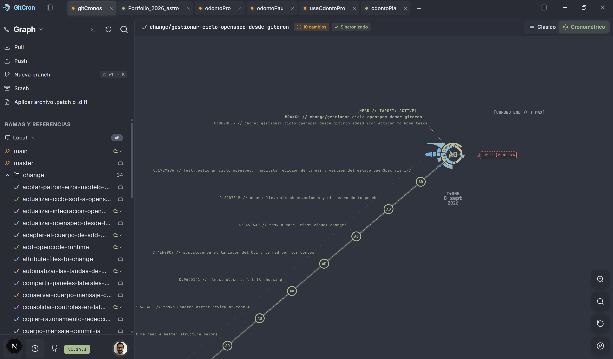
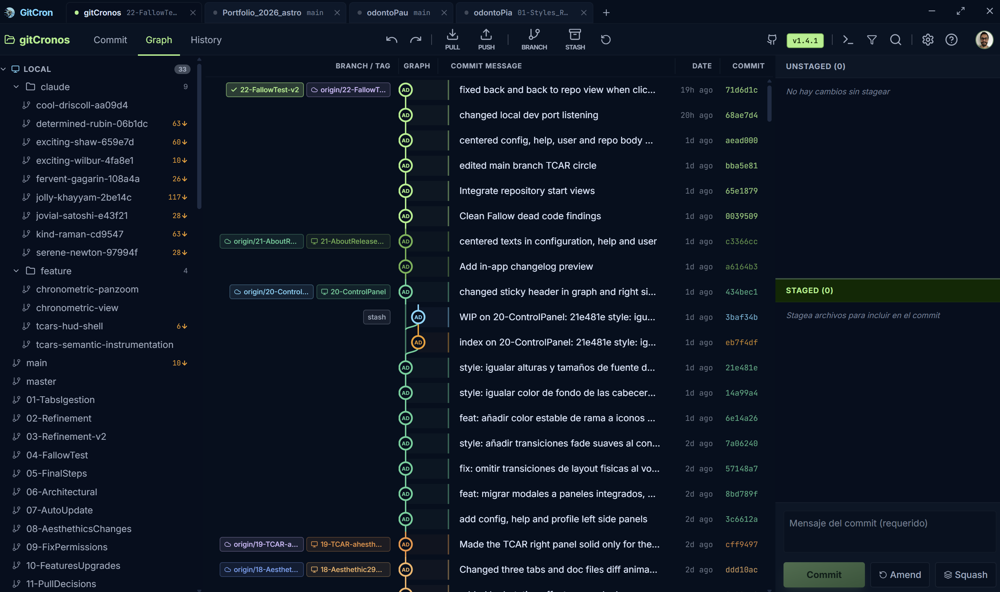
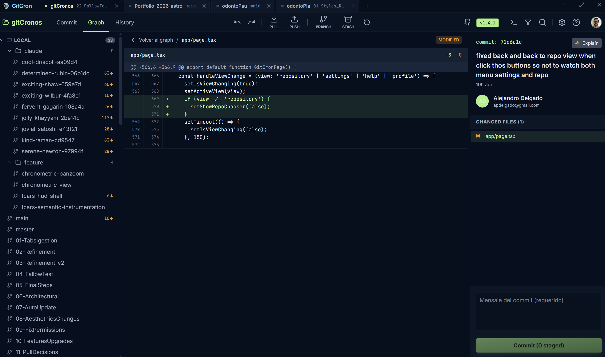
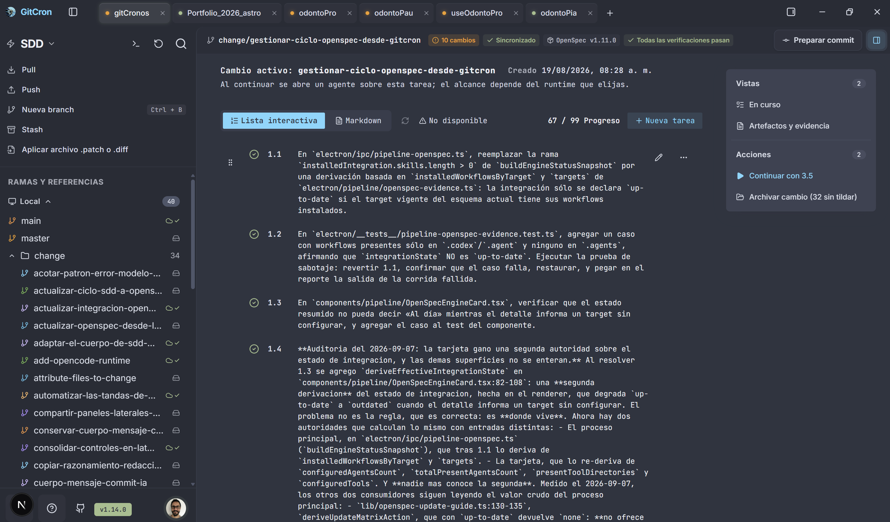

# GitCron — borrador de caso real

Estado editorial: borrador para revisar. No se incorpora todavía a las rutas públicas.

## Datos confirmados por Alejandro

- Idea/producto, diseño UX/UI y desarrollo a su cargo, con asistencia de IA.
- Herramientas de trabajo: Claude, Codex/ChatGPT, Antigravity e IA locales.
- El proceso comenzó con el diseño en Google Stitch y continuó en Google AI Studio, donde obtuvo la maqueta básica de la web app.
- Trabajado durante varios meses; fecha inicial exacta pendiente.
- Repositorio público: https://github.com/alejandropd-1/gitcron
- El contenido actual del portfolio es una maqueta; no se usa como fuente biográfica.

## Texto propuesto para el portfolio

### GitCron // Visual Git Client

**Descripción breve:** Un cliente Git de escritorio que reúne el historial visual, la revisión de cambios y la gestión de repositorios en una misma interfaz. Un proyecto que desarrollé desde la idea y el diseño UX/UI hasta la implementación, trabajando con asistencia de varias herramientas de IA.

**Rol:** Concepto de producto, diseño UX/UI y desarrollo con asistencia de IA.

**El problema:** El punto de partida fue construir una herramienta propia para trabajar con Git mediante una interfaz visual, con foco en el historial, las operaciones sobre repositorios y la integración con GitHub.

**La solución:** GitCron organiza repositorios en pestañas y permite recorrer el historial de commits, inspeccionar diferencias y preparar cambios antes de confirmarlos. La interfaz reúne el estado del repositorio y las acciones habituales de Git para dar contexto a cada operación.

**Mi participación:** Trabajé en el concepto del producto, la experiencia de uso, el diseño de la interfaz y el desarrollo. Durante varios meses combiné Claude, Codex/ChatGPT, Antigravity y modelos locales como herramientas de asistencia. Esa colaboración forma parte del proceso con el que construí el proyecto.

**Del diseño a la aplicación:** Empecé diseñando la interfaz en Google Stitch. Después continué en Google AI Studio, donde obtuve una maqueta básica de la web app. Esa primera base visual fue el punto de partida para seguir desarrollando GitCron con asistencia de IA e integrar las operaciones de Git en una aplicación de escritorio.

**Evolución de la interfaz:** Las capturas conservadas muestran distintas etapas del proyecto. La versión 1.4.1 organizaba el trabajo alrededor del grafo clásico, el historial y la revisión de diferencias. En las capturas de la versión 1.14.0 aparecen también una vista cronométrica del historial y un espacio de seguimiento de especificaciones y tareas. El caso muestra esa evolución visual; las capturas por sí solas no certifican el funcionamiento de cada operación.

**Base técnica:** Electron, Next.js, React, TypeScript, Zustand, simple-git y Octokit.

**Resultado documentado:** Una aplicación de escritorio con código disponible públicamente. El caso puede mostrar flujos concretos de historial, revisión de diferencias y preparación de commits. Todavía no se incluyen cifras de adopción, ahorro de tiempo ni resultados de pruebas con usuarios.

## Selección de capturas reales

Se copiaron cuatro originales sin modificación desde `G:/Mi unidad/laburo/gitCron/recursos` a `docs/cases/assets/gitcron/`. Se comprobó la igualdad de hashes entre cada copia y su original. Las fechas de archivo sirven para ordenar el material; no fijan por sí mismas la fecha de inicio del proyecto.

### 1. Portada propuesta: vista cronométrica

Origen: `Screenshot_10.png`, modificado el 8 de septiembre de 2026. Versión 1.14.0 visible. Su composición y representación del historial le dan una identidad reconocible como portada; mantener también una imagen del grafo clásico para explicar el uso habitual.

Pie propuesto: **Una exploración visual del historial: la vista cronométrica de GitCron 1.14.0.**

### 2. Etapa anterior: grafo clásico

Origen: `01_Graph.png`, modificado el 28 de mayo de 2026. Versión 1.4.1 visible. Esta captura corresponde a una etapa anterior de la aplicación; no es la maqueta original de Stitch.

Pie propuesto: **El grafo clásico en una etapa anterior del proyecto, con ramas, commits y preparación de cambios en una misma pantalla.**

### 3. Revisión de diferencias

Origen: `04_diff.png`, modificado el 28 de mayo de 2026. Se ven líneas añadidas y el contexto del commit. Esta imagen explica mejor la revisión de cambios que `02_commit.png`, que muestra un estado vacío con el working tree limpio.

Pie propuesto: **La revisión del código conecta las líneas modificadas con el archivo y el commit al que pertenecen.**

### 4. Evolución hacia especificaciones y tareas

Origen: `Screenshot_12.png`, modificado el 8 de septiembre de 2026. Muestra el detalle de tareas; `Screenshot_11.png` queda como alternativa de vista general. Los contadores y mensajes de verificación describen el estado capturado, no métricas de impacto del producto ni una validación actual.

Pie propuesto: **El espacio de especificaciones incorpora tareas y acciones de seguimiento junto al contexto del repositorio.**

## Evidencias del proceso inicial

- `gemini-code-1778677815770.md`: prompt para una maqueta de cliente Git con tres columnas, grafo, panel de detalle y gestión de repositorios; explicita la referencia visual de GitKraken.
- `gemini-code-1778678926052.md`: parte de una interfaz generada con Stitch y plantea conectar las acciones visuales con Git mediante simple-git y un puente IPC. Es una especificación de trabajo, no prueba de implementación.
- Los cinco JPEG con nombres UUID muestran **GitKraken Desktop** (gestión de repositorios, clonación, grafo y menú contextual). Se identifican como referencias de otro producto y no se usan en la galería de GitCron.
- No se identificó una captura inequívoca de la maqueta de Stitch o Google AI Studio entre las imágenes revisadas. El orden Stitch → AI Studio proviene del relato de Alejandro.

## Preparación pendiente para la web

- Exportar variantes optimizadas de las cuatro imágenes cuando se integre el caso, preservando legibilidad de texto y dimensiones; estas copias son originales de trabajo.
- Las capturas incluyen nombres de repositorios, ramas y datos de autor. La selección conserva el material tal como fue provisto; revisar la presentación final al incorporarlo a la web.
- Incorporar una decisión de UX explicada por Alejandro: qué problema encontró y por qué eligió una alternativa. No atribuir a las imágenes resultados de pruebas de usuarios.

## Mapeo a TinaCMS

- `title`: `GitCron // Visual Git Client`
- `type`: `Desktop Application`
- `description`: descripción breve propuesta arriba.
- `role`: `Product concept, UX/UI design & AI-assisted development`
- `client`: `Personal project` (propuesta editorial, pendiente de confirmar).
- `timeline`: `Several months` (sin inventar fecha inicial).
- `categories`: `ui-ux`, `systems`.
- `stack`: Electron, Next.js, React, TypeScript, Zustand, simple-git, Octokit.
- `image`: portada propuesta `gitcron-v1-14-0-chronometric.png`; asignar ruta pública al integrar las variantes optimizadas.
- `status`: definir según el estado que Alejandro quiera comunicar; no heredar `DEPLOYED`.
- `showInPortfolio` / `showInResume`: definir al aprobar la ficha.
- `date`: definir como fecha editorial del caso, separada de la fecha de inicio del proyecto.
- Cuerpo: problema, solución, participación, proceso Stitch → AI Studio → desarrollo, evolución visual, base técnica y resultado documentado.

El portfolio actual está en inglés. Este borrador está en español para revisar el contenido primero; traducir al cargarlo si se mantiene ese idioma.

## Fuentes y límites

- Declaraciones de Alejandro en esta conversación, 2026-09-10: autoría, uso de IA y duración aproximada.
- Ampliación de Alejandro en esta conversación: diseño inicial en Google Stitch y maqueta básica obtenida en Google AI Studio.
- Inspección visual de 12 imágenes de `G:/Mi unidad/laburo/gitCron/recursos`, y lectura de los dos prompts `gemini-code-*.md`. Selección de cuatro capturas de GitCron copiadas sin cambios.
- README y package.json del checkout `C:/www/gitCronos`, consultados el 2026-09-10.
- [Repositorio público](https://github.com/alejandropd-1/gitcron), consultado el 2026-09-10: descripción, stack y funcionalidades documentadas.
- Se revisó documentación; no se ejecutó la aplicación ni se certificó el funcionamiento de cada característica en esta tarea.
